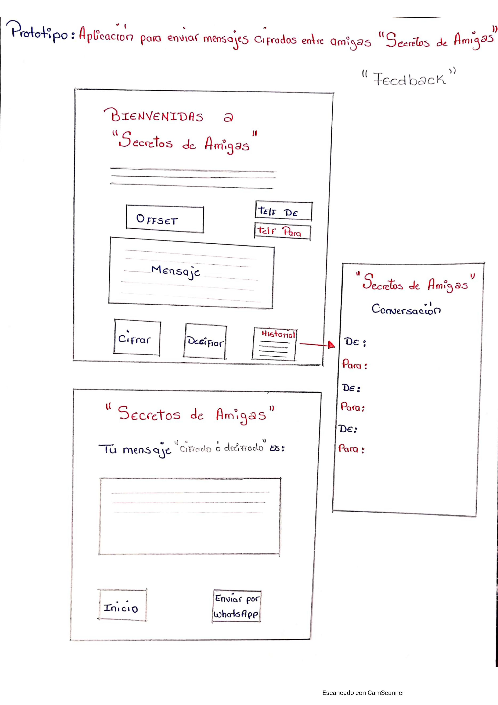
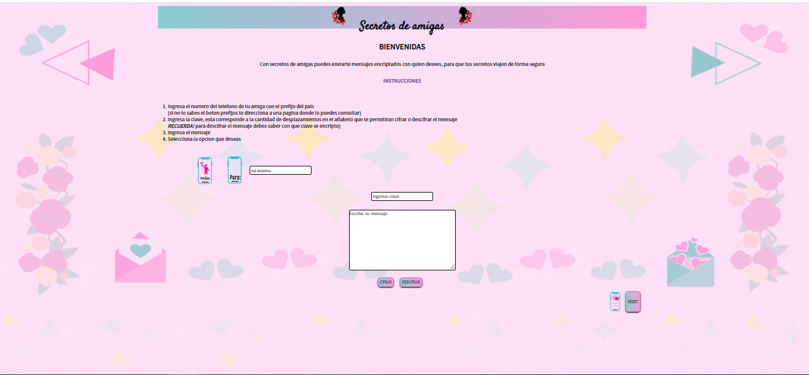

# **_SECRETOS DE AMIGAS_**

***¿Quiénes son los principales usuarios de producto?***

Mujeres  de todas las edades que desean comunicarse con amigas mediante mensajes ocultos.

***¿Cuáles son los objetivos de estos usuarios en relación con tu producto?***

Encriptar mensajes a través de la aplicación  ***Secretos de Amigas*** para enviarlos por sus red social **WhatsApp**.

***¿Cómo crees que el producto que estás creando está resolviendo sus problemas?***

Porque esta facilitando la comunicación entre mujeres en un lenguaje cifrado que solo ellas entenderán.

## Descripción
***Secretos de  amigas*** nace de la necesidad de mantener privada cierta información que  las usuarias de  **WhatsApp** desean compartir con sus contactos, sin que la red social pueda tener acceso a ella. 

Para el diseño de la aplicación se realizaron varios prototipos, siendo el inicial uno en papel, en el que se plasmo como seria la interfaz del usuario, entendiendo que la interfaz fuera precisa y concisa con la información que se requiere para el uso de la misma, evitando así que el usuario cometa errores durante su interacción. Además le permita de forma intuitiva manejar la interfaz de una  manera sencilla y práctica.

Para el prototipado final, se realizo mediante el  sitio web de diseño gráfico llamado ***Canva***, después de haber obtenido el feedback del prototipo inicial, se plasmaron las recomendaciones referente al diseño, en esta etapa básicamente se  emplearon códigos de colores para crear las combinaciones implementadas y se profundizo en las funcionalidades  para ser mas  agradable a la vista la interfaz.

prototipo final

Producto final

# Instalación y configuración del proyecto

1. <a href="https://nodejs.org/es/download/current/">Instalar  Node.js versión v13.11.0</a>
2. Abrir  el editor de texto <a href="https://nodejs.org/es/download/current/">(Visual Studio Code)</a>.
3. Realiza un  ***fork*** en GitHub de este repositorio que contiene el *boilerplate*.
4. Ejecuta en la terminal el comando ***(git clone https://github.com/rosannyoropeza/BOG002-cipher.git)***.
5. Cierra el editor.
6. Desde la carpeta BOG002-cipher realiza un click derecho, abrir con editor de texto (Visual Studio Code).
7. Desde Visual Studio Code abre la terminal ***bash*** para ejecutar el programa. 
8. Usa el comando ***npm start*** para arrancar el servidor web. 
9. Dirígete a http://localhost:5000 en tu navegador, para ver la interfaz del programa en el navegador. 

# Retro Sprint #1

***¿Qué funcionó en el sprint?***

La planificación fue la base fundamental, ya que nos permitió  hacer el pyoyecto en conjunto sin  dividirnos tareas.  Asimismo  facilito el ir avanzando en mini tareas un paso a la vez de forma ordenada. Lo cual arrojo como punto positivo enfocarnos en los temas de investigación que fueran necesarios. 

***¿Qué se puede hacer diferente?***

Programar más horas para trabajar en conjunto.

***¿Por qué no se cubrieron algunos?***

Todos los objetivos propuestos se cumplieron de manera satisfactoria.

***¿Qué funcionó para completar los que se completaron?***

Organizar el proyecto en mini tareas para así enfocarnos solo en ellas, y solicitar las ayudantías para despejar dudas que permitieran seguir avanzando. 

# Objetivos de aprendizaje

Trabajando en parejas aprenderán a construir una aplicación web que interactuará
con lx usuarix final a través del navegador, utilizando HTML, CSS y JavaScript
como tecnologías.

### HTML y CSS

- [x] Uso de HTML semántico.
- [x] Uso de selectores de CSS.
- [x] Construir tu aplicación respetando el diseño realizado (maquetación).

### DOM

- [x] Uso de selectores del DOM.
- [x] Manejo de eventos del DOM.
- [x] Manipulación dinámica del DOM
      (appendChild |createElement | createTextNode| innerHTML | textContent | etc.)

### JavaScript

- [x] Manipulación de strings.
- [x] Uso de condicionales (if-else | switch | operador ternario)
- [x] Uso de bucles (for | for..in | for..of | while)
- [x] Uso de funciones (parámetros | argumentos | valor de retorno)
- [x] Declaración correcta de variables (const & let)

### Testing

- [x] Testeo unitario.

### Estructura del código y guía de estilo

- [ ] Organizar y dividir el código en módulos (Modularización)
- [ ] Uso de identificadores descriptivos (Nomenclatura | Semántica)
- [ ] Uso de linter (ESLINT)

### Git y GitHub

- [x] Uso de comandos de git (add | commit | pull | status | push)
- [x] Manejo de repositorios de GitHub (clone | fork | gh-pages)

### UX

- [x] Diseñar la aplicación pensando y entendiendo al usuario.
- [x] Crear prototipos para obtener feedback e iterar.
- [x] Aplicar los principios de diseño visual (contraste, alineación, jerarquía)

# Checklist

### Parte Obligatoria

- [x] `README.md` incluye info sobre proceso y decisiones de diseño.
- [x] `README.md` explica claramente quiénes son los usuarios y su relación con
      el producto.
- [x] `README.md` explica claramente cómo el producto soluciona los
      problemas/necesidades de los usuarios.
- [x] Usa VanillaJS.
- [x] No utiliza `this`.
- [x] Implementa `cipher.encode`.
- [x] Implementa `cipher.decode`.
- [x] Pasa linter con configuración provista.
- [x] Pasa pruebas unitarias.
- [x] Pruebas unitarias cubren 70% de _statements_, _functions_ y _lines_, y un
      mínimo del 50% de _branches_.
- [x] Interfaz permite elegir el `offset` o _desplazamiento_ a usar en el
      cifrado/descifrado.
- [x] Interfaz permite escribir un texto para ser cifrado.
- [x] Interfaz muestra el resultado del cifrado correctamente.
- [x] Interfaz permite escribir un texto para ser descifrado.
- [x] Interfaz muestra el resultado del descifrado correctamente.

### Parte Opcional: "Hacker edition"

- [x] Cifra/descifra minúsculas
- [ ] Cifra/descifra _otros_ caracteres (espacios, puntuación, `ñ`, `á`, ...)
- [x] Permite usar un `offset` negativo.
